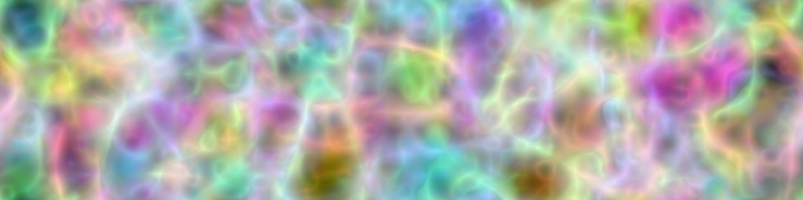

Noisemaker CLI
==============

.. toctree::
   :maxdepth: 2
   :caption: Contents:

Noisemaker includes a CLI utility, ``noisemaker``. Start making some noise!

.. code-block:: bash

    noisemaker --shadow --sharpen multires --width 1024 --height 512

    # Maybe it's ugly, maybe it's awesome. Random values are random!

See the help screens for usage.

.. program-output:: noisemaker --help

Basic Noise
^^^^^^^^^^^

.. program-output:: noisemaker basic --help

See Also: :py:func:`noisemaker.generators.basic`

Multi-Res Noise
^^^^^^^^^^^^^^^

.. program-output:: noisemaker multires --help

See Also: :py:func:`noisemaker.generators.multires`
