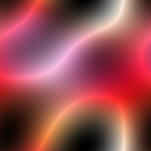

Noisemaker CLI
==============

Noisemaker includes a low-level CLI utility, ``noisemaker``.

This utility exposes all of the possible noise options and is not for the faint of heart. If you're seeking a simpler noise 
generation experience, take a look at :doc:`artmaker` instead.

Sample usage:

.. code-block:: bash

    noisemaker --shadow 0.1 --ridges --width 256 --height 256

    # Maybe it's ugly, maybe it's awesome. Random values are random!

See ``noisemaker --help`` for a complete list of options.

.. literalinclude:: noisemakerhelp.txt
   :language: bash
